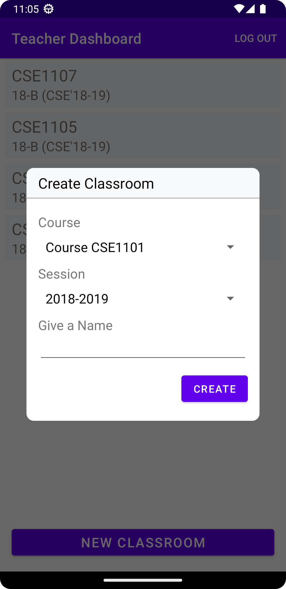
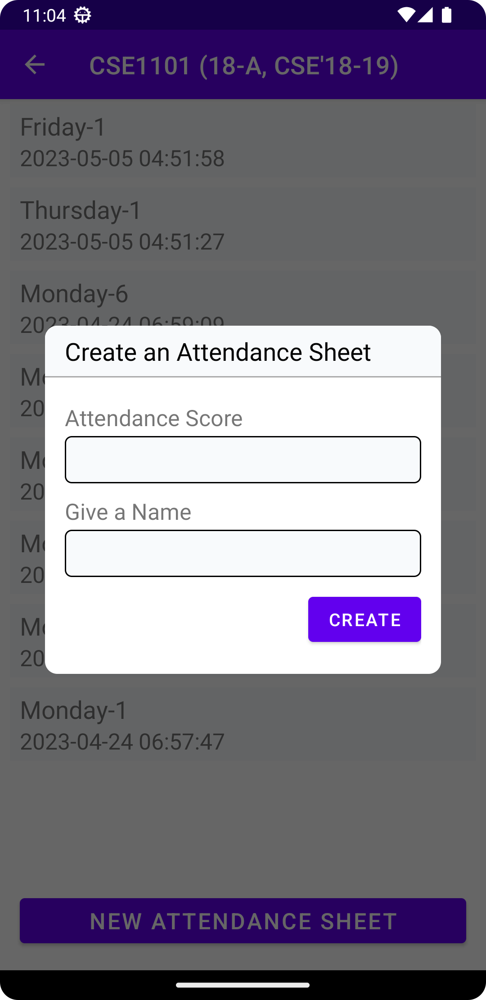

## AtMS
__Attendance Management System__ is an android app built using Kotlin lang. It connects a Larave backend through API and provides some limited features to the students and teachers.

### Features
* Student track their attendance progress
* Teacher create classroom and attendance

### Download
Debug APK is available in the release section of this repository. 

__Software Requiment__: Android 5.0 (API level 21) or up.

### Screenshots
										